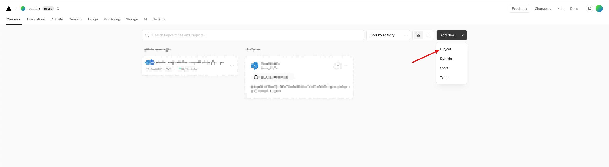
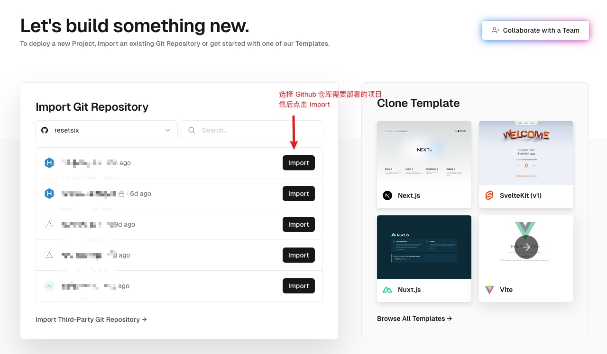
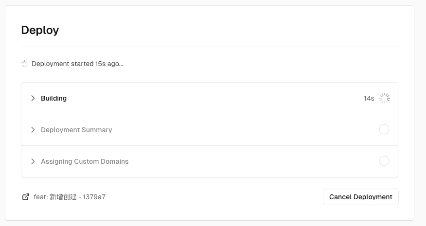
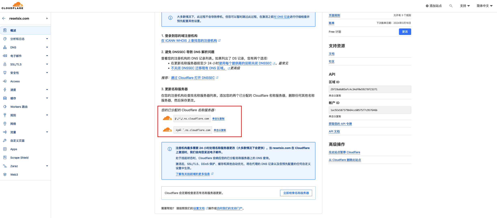
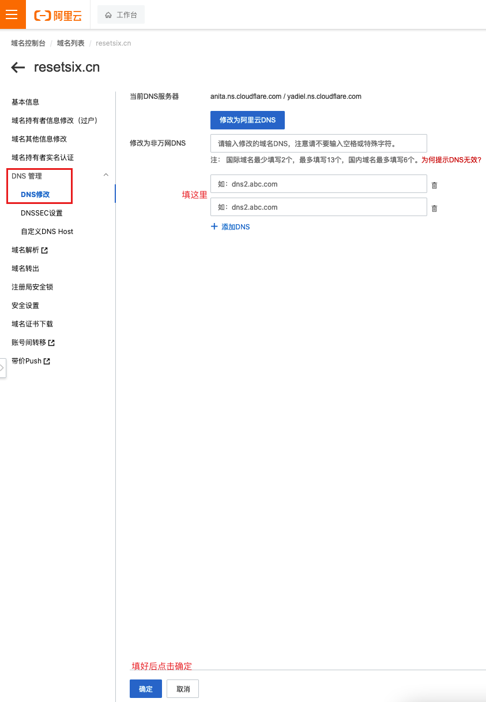
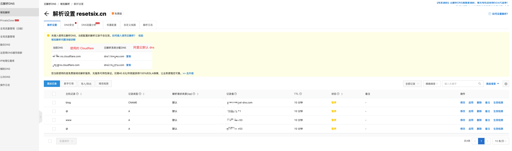
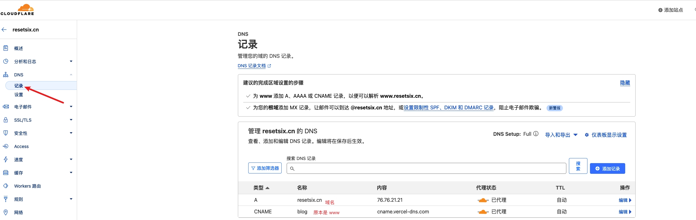
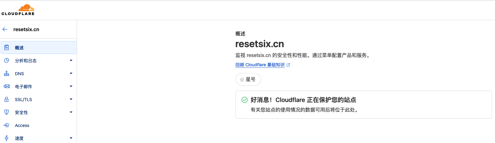
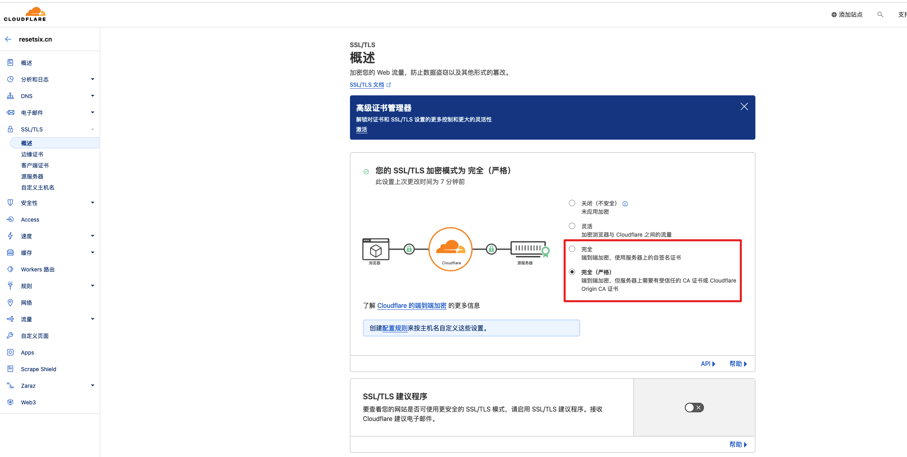

## 概览

> 本文将介绍使用如何通过 Cloudflare 代理在 Vercel 部署的网站；以及使用自定义域名访问。

- 代码托管：**Github**
- CI/CD（自动部署）：[**Vercel**](https://vercel.com/)
- CDN加速（域名/DNS 解析）：[**Cloudflare**](https://dash.cloudflare.com/login)

## 部署过程

- Vercel - dashboard - Add New Project

- 导入 Github 项目

- Vercel 会自动识别项目。若无额外配置，默认点击 deployment 等待片刻即可部署成功。

- 默认会分配一个`项目名.vercel.app`域名，通过该域名即可访问网站。
  - Domains 表示使用自定义域名。
- Vercel 部署成功后，Github 对应代码仓库任何 commit 或 pr都会重新部署。
  - Vercel 的优点就是略过了 Github Pages 的繁琐配置。

## 申请域名

注册略过..
备案略过..
不管在哪个域名注册商注册都行。


## 配置 Cloudflare

- 在 Cloudflare 注册账号之后，选择 `Add a site` 或 添加站点。
- 输入域名。
- 选择 Free（免费版）。
- 会发现两条`已分配的 Cloudflare 名称服务器`。



然后 Cloudflare 这边就没什么事了。

## 修改阿里云默认 DNS 服务

我的域名是在阿里云注册的，所以域名注册商是阿里云，所以默认的 DNS 解析服务也在阿里云。
现在需要做的事情是：将默认的 dns 解析服务修改为 Cloudflare。

- 阿里云控制台 - 搜索 域名管理 - 域名列表 - 域名详情 - DNS 管理（子选项 DNS修改）- 修改 DNS 服务器
- 将刚才的两条 dns 地址复制到阿里云。可参考阿里云官网文档[修改DNS服务器](https://help.aliyun.com/document_detail/39845.html)



> 注意：因为 dns 服务是由 Cloudflare 取代阿里云默认的。所以需要将阿里云这边的 dns 解析记录全部暂停或删除。



## 激活 Cloudflare 配置

- Vercel 自定义域名后会显示两个域名，一个是输入的域名，另一个是加了 www 前缀。
- 当访问主域名时会 redirect 到 www 域名。
- 查看各自真实 ip 后会发现，前者对应的是 Vercel 分配的一个 ip 地址，后者对应的是 Vercel 分配的访问域名。

- Cloudflare激活操作：将 Vercel 提示的主机记录复制到 Cloudflare DNS 中。



等待几秒钟或返回 Cloudflare 面板就会看见如下提示



> 到这里所有工作结束，但是访问的话还需要等待 24~48 小时，因为修改 DNS 服务需要等待 DNS 传播完成才能生效。

## 结束

## 补充：修复不能访问问题

激活成功后不能访问最开始我以为是 dns 传播问题需要等待一两天，后来发现是 SSL 加密模式等级问题。

需要将 SSL 加密模式设置为`完全`或`完全（严格）`。最开始是`灵活`所以导致访问页面提示

```
页面不能正确地重定向
连接到 resetsix.cn 时发生错误。
有时候禁用或拒绝接受 Cookie 会导致此问题。
```

解决：

